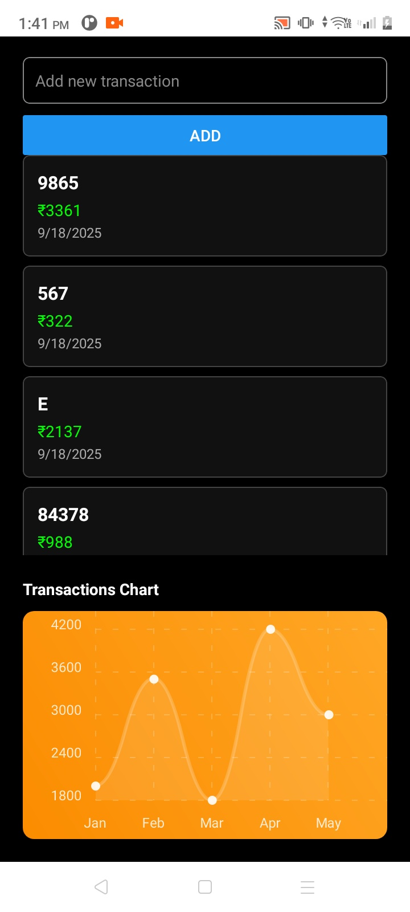

# Part 2 – Coding Implementation

## Screenshots

### Transactions Screen
 

This folder contains React Native TypeScript app and native module templates to demonstrate the required features:
- Transactions list with infinite scroll (FlatList)
- Add Transaction form with Formik + Yup validation and optimistic updates
- React Context + useReducer state management
- Chart integration using react-native-chart-kit (example)
- Axios-based mock API service
- Native module examples for iOS (Swift) and Android (Kotlin)
- Jest unit test example for reducer

## Structure
See the files under `app/`, `native-modules/`, and `tests/`. Use this as a starting point for the coding portion of the assessment.
